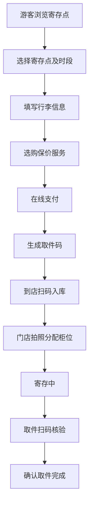

## 1. 产品概述

行李寄存平台是连接游客与车站周边门店的 O2O 服务平台，解决旅客出行时行李携带不便的痛点。游客可在线筛选寄存点、预约时段、在线支付，门店通过平台高效管理寄存业务，客服与运营团队保障服务质量与平台运转。

## 2. 核心功能

### 2.1 用户角色

| 角色 | 描述 | 核心权限 |
|------|------|----------|
| 游客 | 使用寄存服务的旅客 | 浏览寄存点、下单预约、支付、查看订单、取件 |
| 门店 | 提供寄存服务的商家 | 扫码入库、拍照留档、柜位管理、超时标记、续存办理、取件确认 |
| 客服 | 平台客户服务人员 | 处理取消申请、遗失申报、赔付申请、差评回访 |
| 运营 | 平台运营管理人员 | 门店资料维护、价格规则、节假日容量、结算明细 |

### 2.2 功能模块

1. **寄存点列表页**：寄存点卡片展示、多维度筛选（位置/营业时间/箱包尺寸/价格/评分）、容量查看、排序
2. **地图检索页**：地图可视化寄存点分布、位置搜索、周边检索、地图交互
3. **下单页**：时段选择、行李件数填写、保价服务选购、取件码生成、在线支付
4. **订单中心页**：订单列表、订单详情、状态追踪、取消申请
5. **取件核验页**：扫码核验、取件码输入、订单确认
6. **门店工作台**：待处理订单、扫码入库、拍照留档、柜位修改、超时标记、续存办理、取件确认
7. **客服处理页**：取消处理、遗失申报、赔付申请、差评回访
8. **运营报表页**：门店管理、价格规则、节假日容量、结算明细

### 2.3 页面详情

| 页面名称 | 模块名称 | 功能描述 |
|-----------|-------------|---------------------|
| 寄存点列表 | 顶部筛选栏 | 位置搜索、营业时间筛选、尺寸筛选、价格区间、评分筛选 |
| 寄存点列表 | 寄存点卡片 | 门店图片、名称、地址、距离、营业时间、价格、评分、剩余容量、标签 |
| 寄存点列表 | 排序切换 | 综合排序、距离最近、价格最低、评分最高 |
| 地图检索 | 地图区域 | 交互式地图、寄存点标记弹窗 |
| 地图检索 | 搜索栏 | 地点搜索、当前定位 |
| 地图检索 | 列表侧栏 | 地图视野内寄存点列表 |
| 下单页 | 寄存点信息 | 门店名称、地址、营业时间、联系方式 |
| 下单页 | 时段选择 | 存包时间、取包时间选择器 |
| 下单页 | 行李信息 | 行李件数、尺寸选择、物品说明 |
| 下单页 | 增值服务 | 保价服务、加急服务选项 |
| 下单页 | 费用明细 | 基础费用、保价费用、总价计算 |
| 下单页 | 支付模块 | 支付方式选择、取件码预览、确认支付 |
| 订单中心 | 订单列表 | 状态标签、订单卡片、时间筛选、状态筛选 |
| 订单中心 | 订单详情 | 完整订单信息、状态时间线、操作按钮 |
| 取件核验 | 扫码区域 | 摄像头扫码、手动输入取件码 |
| 取件核验 | 核验结果 | 订单信息展示、核验状态、取件确认 |
| 门店工作台 | 数据概览 | 今日寄存数、在存数、待取件数、营收概览 |
| 门店工作台 | 订单列表 | 待入库、在存、待取件、已完成订单 Tab 切换 |
| 门店工作台 | 操作面板 | 扫码入库、拍照上传、柜位编辑、超时标记、续存办理、取件确认 |
| 客服处理 | 工单列表 | 取消申请、遗失申报、赔付申请、差评回访分类 Tab |
| 客服处理 | 工单详情 | 工单信息、处理记录、操作按钮 |
| 运营报表 | 门店管理 | 门店列表、新增/编辑门店、门店状态管理 |
| 运营报表 | 价格规则 | 基础定价、阶梯价格、节假日溢价配置 |
| 运营报表 | 容量管理 | 节假日容量设置、柜位类型配置 |
| 运营报表 | 结算明细 | 结算周期、门店结算、平台抽成明细 |

## 3. 核心流程

### 3.1 游客寄存流程

游客选择寄存点 → 选择寄存时段 → 填写行李信息 → 选购保价服务 → 确认订单并支付 → 生成取件码 → 到店扫码入库 → 存放行李 → 取件时扫码核验 → 确认取件

### 3.2 门店操作流程

门店登录工作台 → 查看待入库订单 → 扫码核验取件码 → 核对行李并拍照 → 分配柜位 → 确认入库 → 存期中可标记超时/办理续存 → 取件时扫码核验 → 确认取件完成

### 3.3 客服处理流程

用户提交申请/申诉 → 客服接收工单 → 核实订单信息与证据 → 与双方沟通 → 做出处理决定 → 记录处理结果 → 关闭工单

## 4. 用户界面设计

### 4.1 设计风格

- **设计理念**：旅行即生活，温暖而专业。以旅行为灵感，营造轻松、信赖、便捷的服务体验。
- **主色调**：琥珀橙（#FF8A3D）- 代表活力、温暖、旅途的阳光
- **辅助色**：深青色（#1E6B6B）- 代表专业、信任、稳重
- **中性色**：暖灰色系 - 营造舒适柔和的视觉感受
- **按钮风格**：圆润大按钮，悬浮有微动效，主按钮使用渐变橙
- **字体**：标题使用现代感无衬线字体，正文清晰易读
- **布局风格**：卡片式布局，大圆角，柔和阴影，充足留白
- **图标风格**：线性图标，统一笔触，点缀橙色
- **动效**：页面切换平滑过渡，卡片悬浮微动，状态变化有渐变反馈

### 4.2 页面设计概览

| 页面名称 | 模块名称 | UI 元素 |
|-----------|-------------|-------------|
| 寄存点列表 | 筛选栏 | 白色背景卡片、圆角筛选标签、橙色激活态 |
| 寄存点列表 | 卡片列表 | 大图卡片、底部信息层、价格标签高亮、容量进度条 |
| 地图检索 | 地图区域 | 全屏地图、自定义标记点、浮动搜索栏 |
| 地图检索 | 侧栏列表 | 半透明玻璃质感、滚动列表、选中高亮 |
| 下单页 | 表单区域 | 分组卡片、时间选择器、数字步进器、价格实时计算 |
| 下单页 | 支付栏 | 底部固定、总价醒目、大按钮支付 |
| 订单中心 | 订单列表 | 状态色标签、时间线、卡片堆叠 |
| 门店工作台 | 数据概览 | 数据卡片、渐变背景、数字动效 |
| 门店工作台 | 操作面板 | 功能图标网格、快捷操作、状态徽章 |
| 运营报表 | 数据表格 | 斑马纹、悬浮高亮、操作列按钮 |

### 4.3 响应式设计

- 采用桌面端优先设计，适配 1440px 及以上宽度
- 平板端：1024px 断点，侧栏可收起，卡片两列布局
- 移动端：768px 断点，单列布局，底部导航，触摸优化
- 关键操作按钮保证 44px 最小触摸区域

### 4.4 视觉细节

- 背景使用浅暖灰底色，营造温暖氛围
- 卡片使用柔和阴影与微圆角（16px）
- 重要数据使用大号粗体字，搭配琥珀橙强调
- 状态标签使用不同颜色区分（进行中-青、已完成-绿、异常-红）
- 空状态与加载状态配有插画与微动效
