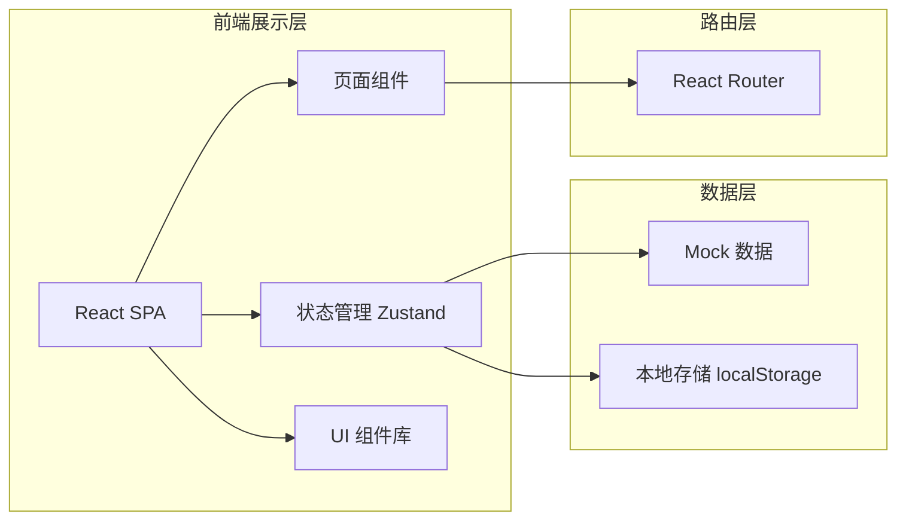
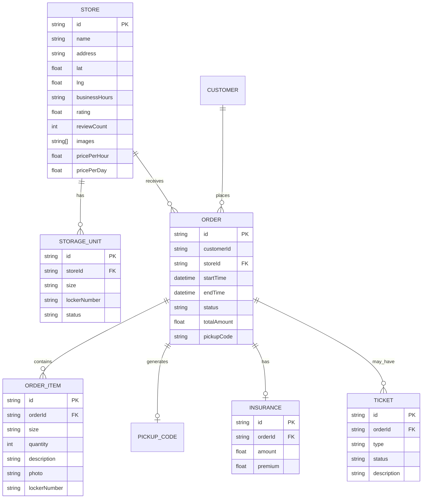

## 1. 架构设计



## 2. 技术描述

- **前端框架**：React@18 + TypeScript
- **构建工具**：Vite@5
- **路由管理**：react-router-dom@6
- **状态管理**：zustand@4
- **样式方案**：TailwindCSS@3
- **图标库**：lucide-react
- **数据方案**：Mock 数据 + localStorage 持久化
- **代码规范**：TypeScript 类型检查

## 3. 路由定义

| 路由路径 | 页面名称 | 角色 | 描述 |
|-----------|----------|------|------|
| / | 寄存点列表 | 游客 | 首页，寄存点列表与筛选 |
| /map | 地图检索 | 游客 | 地图模式查找寄存点 |
| /order/create/:storeId | 下单页 | 游客 | 预约寄存，填写信息，支付 |
| /orders | 订单中心 | 游客 | 订单列表与详情 |
| /pickup | 取件核验 | 通用 | 扫码或输入取件码核验 |
| /store/workbench | 门店工作台 | 门店 | 门店订单管理与操作 |
| /service | 客服处理 | 客服 | 工单处理中心 |
| /admin | 运营报表 | 运营 | 运营管理后台 |

## 4. 数据模型

### 4.1 实体关系



### 4.2 核心数据类型

```typescript
// 寄存点
interface Store {
  id: string;
  name: string;
  address: string;
  lat: number;
  lng: number;
  businessHours: string;
  rating: number;
  reviewCount: number;
  images: string[];
  pricePerHour: number;
  pricePerDay: number;
  tags: string[];
  capacity: {
    small: { total: number; available: number };
    medium: { total: number; available: number };
    large: { total: number; available: number };
  };
}

// 订单
interface Order {
  id: string;
  storeId: string;
  storeName: string;
  customerName: string;
  customerPhone: string;
  startTime: string;
  endTime: string;
  actualEndTime?: string;
  status: 'pending' | 'stored' | 'extended' | 'overdue' | 'completed' | 'cancelled';
  items: OrderItem[];
  insurance?: Insurance;
  basePrice: number;
  insurancePrice: number;
  totalPrice: number;
  pickupCode: string;
  createdAt: string;
  lockerNumber?: string;
  photoUrl?: string;
}

// 订单项
interface OrderItem {
  id: string;
  size: 'small' | 'medium' | 'large';
  quantity: number;
  description: string;
}

// 保价服务
interface Insurance {
  amount: number;
  premium: number;
}

// 客服工单
interface Ticket {
  id: string;
  orderId: string;
  type: 'cancel' | 'lost' | 'compensation' | 'complaint';
  status: 'pending' | 'processing' | 'resolved' | 'closed';
  description: string;
  createdAt: string;
  handler?: string;
  handleNotes?: string;
}

// 结算记录
interface Settlement {
  id: string;
  storeId: string;
  storeName: string;
  period: string;
  orderCount: number;
  totalAmount: number;
  platformFee: number;
  storeIncome: number;
  status: 'pending' | 'settled';
}
```

## 5. 目录结构

```
src/
├── components/          # 通用组件
│   ├── Layout/         # 布局组件
│   ├── StoreCard/      # 寄存点卡片
│   ├── OrderCard/      # 订单卡片
│   └── common/         # 通用 UI 组件
├── pages/              # 页面组件
│   ├── StoreList/      # 寄存点列表
│   ├── MapSearch/      # 地图检索
│   ├── OrderCreate/    # 下单页
│   ├── OrderCenter/    # 订单中心
│   ├── PickupVerify/   # 取件核验
│   ├── StoreWorkbench/ # 门店工作台
│   ├── ServiceCenter/  # 客服处理
│   └── AdminReport/    # 运营报表
├── store/              # 状态管理
│   ├── useStoreStore.ts
│   ├── useOrderStore.ts
│   └── useUserStore.ts
├── data/               # Mock 数据
│   ├── stores.ts
│   ├── orders.ts
│   └── tickets.ts
├── utils/              # 工具函数
│   ├── format.ts
│   └── calculator.ts
├── types/              # TypeScript 类型
│   └── index.ts
├── App.tsx
├── main.tsx
└── index.css
```

## 6. 核心状态管理

使用 zustand 管理全局状态：

- **useStoreStore**：寄存点数据、筛选条件、地图状态
- **useOrderStore**：订单列表、当前订单、订单操作
- **useUserStore**：当前用户角色、身份信息

状态持久化通过 zustand persist 中间件 + localStorage 实现。
